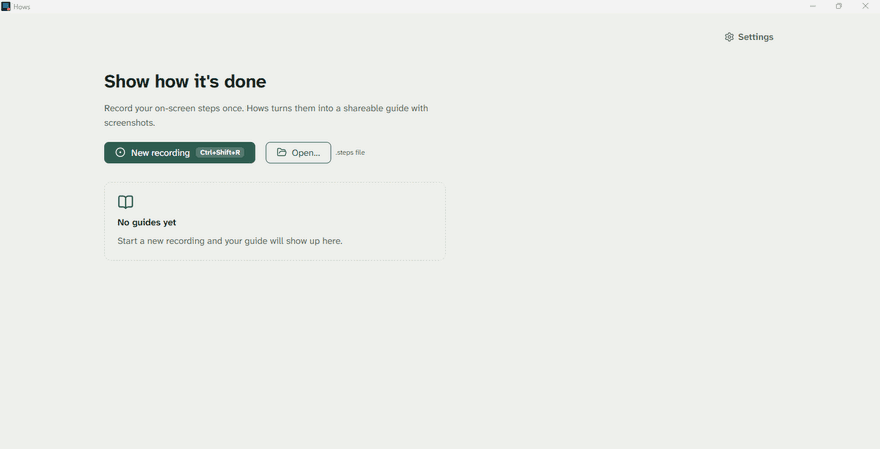

English | [Deutsch](README.de.md)

# Hows

*How's how? Hows knows.*

Hows records what you click and turns it into an illustrated step-by-step guide. It is a modern, open-source successor to the Windows Steps Recorder (`psr.exe`), which Microsoft has deprecated.



Hows needs no account and sends no telemetry. After install, the running app does not open network connections. The NSIS and MSI installers download WebView2 from Microsoft when it is missing. Hows does not upload guides to a Hows cloud; a folder synced by OneDrive or similar can still copy files you save there. Typed characters are not stored as keyboard input, only the fact that you typed and where. Guides are saved in an open, documented `.steps` format. The app exports them as a single HTML file or a PDF; the command line adds Markdown and JSON, either as a clean how-to guide or as a bug report with technical metadata.

Windows first. Built with Tauri 2, Rust, and Svelte 5. MIT licensed.

**Documentation:** [user guide and reference](docs/en/README.md)

## What it does

1. Press <!-- fact:settings.hotkey keys -->`Ctrl+Shift+R`<!-- /fact --> (or the button, or the notification area icon) and work as usual.
2. Every click, double-click, right-click, and shortcut with `Ctrl`, `Alt`, or `Win` becomes a step with a screenshot and a readable sentence such as *Click “Save” in “Notepad”*. Scrolling in one window and direction stays one step until you pause, and the sentence names that window and how far you scrolled, for example *Scroll down 3 in “Documents”*. Typing stays one step until you pause.
3. Stop with the same shortcut. Review the steps, edit step text, reorder or delete steps, and annotate screenshots with rectangles, arrows, circles, pen, highlighter, blur, and text.
4. Export: HTML (one self-contained file), PDF (<!-- fact:export.papers ui:paperNames -->A4 or US Letter<!-- /fact -->), or the `.steps` file to edit later. HTML and PDF use your style, your accent color, and the embedded Hows font. A small “<!-- fact:i18n.export.credit -->Created with Hows<!-- /fact -->” line ends each HTML export and sits in the footer of every PDF page; you can turn it off in the settings. `steps-cli` also writes Markdown with images and JSON.

The interface and generated step text are available in English, German, French, Spanish, Italian, Portuguese, and Dutch. On first start, Hows follows the Windows display language; you can switch languages in the settings at any time.

## How it compares

| | **Hows** | Windows Steps Recorder | [OpenSteps](https://github.com/ebanez8/openstep) | [BetterStepsRecorder](https://github.com/Better-World-Solutions/BetterStepsRecorder-Community) | [Folge](https://folge.me) | Scribe / Tango |
|---|---|---|---|---|---|---|
| License | MIT | proprietary, deprecated | MIT | MIT | proprietary | proprietary |
| Runs | local after install | local | local | local | local | cloud |
| Keyboard | never plain text; shortcuts only, typing shown as “<!-- fact:i18n.step.text_input -->Type your text<!-- /fact -->” | key names in step text | typing detected, characters not stored | per-step metadata | yes | yes |
| Step text | deterministic templates from UI Automation | raw UI Automation text | click context | click context | manual/automatic | AI-generated |
| File format | `.steps` (ZIP with `guide.json` and PNGs), [documented](docs/en/file-format.md) | `.mht` | `session.json` plus PNGs | project-specific | proprietary | cloud |
| Export | HTML, PDF, Markdown, JSON; guide and bug-report mode | MHT | Markdown, HTML | RTF, HTML, ODT, Obsidian | PDF, Word, PowerPoint, HTML, Markdown, JSON, SCORM, GIF | PDF, HTML, links |
| Annotations | rectangle, arrow, circle, pen, highlighter, blur, text; non-destructive | none | rectangle, arrow, highlight, numbers | text editing | yes | yes |
| Scripted guides | `steps-cli from-script` builds guides without a desktop | no | no | no | no | API in paid tiers |
| Code signing | not yet | signed | not yet | N/A | yes | N/A |

Sources: [Microsoft on the Steps Recorder deprecation](https://support.microsoft.com/en-us/windows/apps/steps-recorder-deprecation), the linked project pages, [Scribe pricing](https://scribehow.com/pricing), [Tango pricing](https://www.tango.ai/pricing).

## Install

Hows 0.1.0 is an early alpha. Download it from the [Releases](https://github.com/swayaa/hows/releases) page. The builds are unsigned, so Windows SmartScreen warns on first start. You can also build Hows yourself (below).

- [Install Hows](docs/en/install.md): which file to pick, WebView2, updates, and removal.
- [The SmartScreen warning](docs/en/smartscreen.md): why it appears and how to continue.

## Build

Requirements: Windows 10/11, Rust stable (<!-- fact:build.rust_version -->1.88<!-- /fact --> or newer), Node.js 22, and the [Tauri prerequisites](https://v2.tauri.app/start/prerequisites/) (WebView2 ships with Windows 11).

```bash
cd app
npm ci
npm run tauri build
```

| Output | Path |
|---|---|
| NSIS installer | `app/src-tauri/target/release/bundle/nsis/*-setup.exe` |
| MSI | `app/src-tauri/target/release/bundle/msi/*.msi` |
| `hows.exe` | `app/src-tauri/target/release/hows.exe` |

`npm run tauri build` writes `hows.exe`. The portable distribution is the ZIP from `scripts/release/pack-portable.ps1`: `hows.exe`, `LICENSE`, and `THIRD-PARTY-NOTICES.md`. The release workflow publishes that ZIP and does not publish `hows.exe` on its own.

For a development window with hot reload: `npm run tauri dev`.

## Command line

`steps-cli` works on every platform and needs no desktop capture. It exports existing guides and builds new ones from a JSON script, which is handy for CI, documentation pipelines, and AI agents.

```bash
# Demo guide plus every export format
cargo run --manifest-path core/Cargo.toml -p steps-cli -- demo -o ./out

# Export a .steps file (html | pdf | markdown | json; --mode sop | bug-report)
cargo run --manifest-path core/Cargo.toml -p steps-cli -- \
  export guide.steps --format pdf -o guide.pdf

# Build a guide from a script; --html without a path writes guide.html next to it
cargo run --manifest-path core/Cargo.toml -p steps-cli -- \
  from-script docs/examples/agent-steps.en.json -o guide.steps --html
```

All commands and the script format: [Command line](docs/en/cli.md).

## Privacy

After install, the running app does not open network connections. If Microsoft's WebView2 runtime is missing (it ships with Windows 11), the NSIS and MSI installers download it from Microsoft. The portable ZIP does not. Hows does not upload guides to a Hows cloud. The `.steps` file on your disk holds your steps, usually each with its original screenshot, and the details Windows provided: the window title, app name, and UI element that was clicked.

Recording starts from the shortcut, the button, or the notification area. Hows has no consent step in the app for other people, and Windows shows no screen-recording permission dialog for these hooks. Recording or sharing someone else's screen, workplace, call, or chat is your responsibility.

Exports from the app use guide mode: the title, step texts, and screenshots, without the separate technical fields. A step text can still name a visible button or field and the window title, which in a browser is the page title. The bug-report mode (`steps-cli export --mode bug-report`) adds window titles, element details, click positions, timestamps, and the operating system. It adds the Windows version only when the file contains one, and recordings from the app don't for now. Screenshots show whatever was on screen and can contain private data, so check them and the step texts before sharing; the blur tool hides sensitive regions. The MIT license covers Hows, not the captured interface in those screenshots or titles.

Exports go to your Documents folder by default. If that folder is synced by OneDrive, the export sheet says so before you export and lets you pick another folder. Details: [Privacy](docs/en/privacy.md).

## Known limitations

- Builds are not code-signed yet, so SmartScreen warns on first start.
- Recording works on Windows only. On Linux, the app runs with a stub recorder and the CLI works fully; macOS is untested.
- Steps come from UI Automation. Apps with a poor accessibility tree (some games, remote desktops, custom-drawn UIs) get generic step texts.
- The app exports HTML, PDF, and `.steps`; Markdown and JSON need `steps-cli` for now.
- The browser extension for richer web steps (`extension/`) is planned but empty.

## Repository layout

```
core/        Rust workspace: capture, i18n, session, store, export, cli
app/         Tauri 2 + Svelte 5 desktop app
extension/   browser extension (planned)
docs/        user documentation (en, de), file format and examples
scripts/     smoke test and documentation checks
```

## Contributing

Bug reports, incorrect step text, and pull requests are welcome. See [CONTRIBUTING.md](CONTRIBUTING.md). Security issues: [SECURITY.md](SECURITY.md). Changes: [CHANGELOG.md](CHANGELOG.md).

## License

[MIT](LICENSE). The license covers Hows, not the content of screenshots or step texts in a guide. Third-party components and their licenses: [THIRD-PARTY-NOTICES.md](THIRD-PARTY-NOTICES.md).
